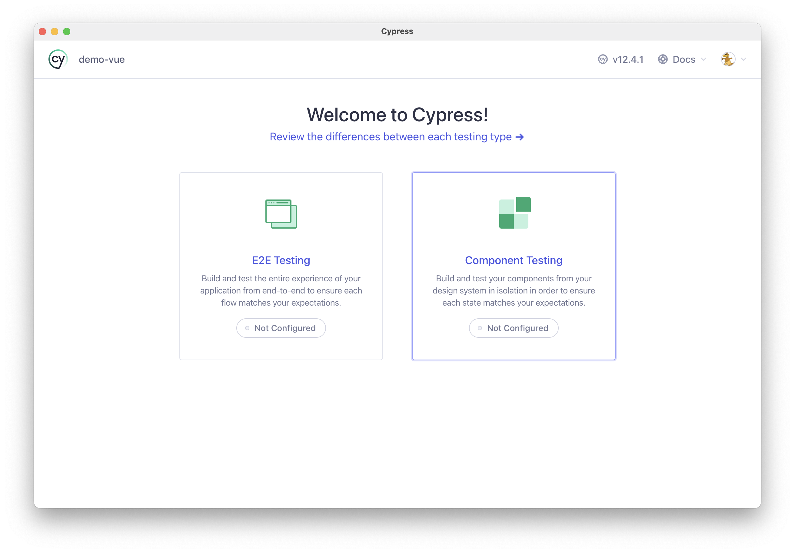
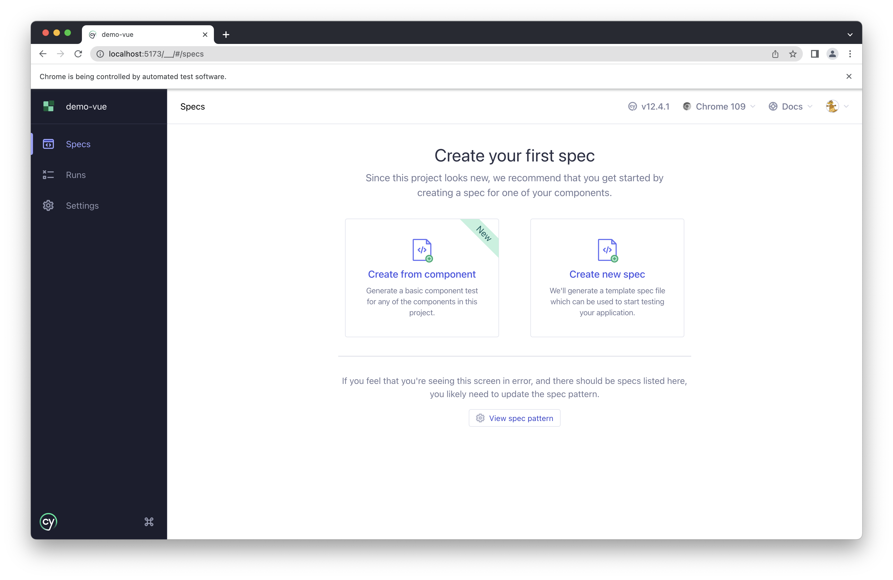

# Getting Started

The examples in this guide use [Vite](https://vitejs.dev), which has templates for React, Vue, and other frameworks. It also uses TypeScript, although this won't impact the vast majority of examples.

Create a new Vue app by running

```sh
npm create vite@latest demo-vue -- --template vue-ts
cd demo-vue
npm install cypress typescript
# optional - adding tailwind
npm install tailwindcss
npx tailwindcss init
```

Open Cypress with `npx cypress open`. You should see



Click "Component Testing", follow the prompts - it will scaffold a few files. Click you favorite browser, and now you are in Cypress!



Head into the next section to start creating components and tests!