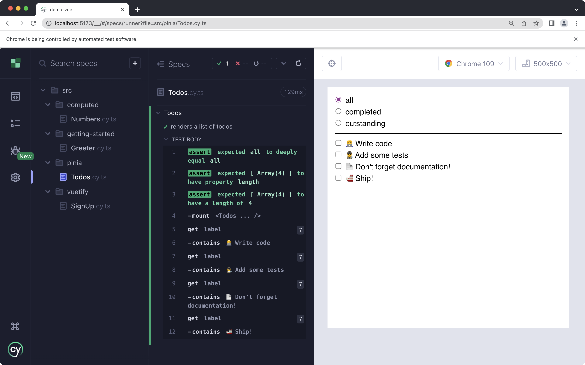
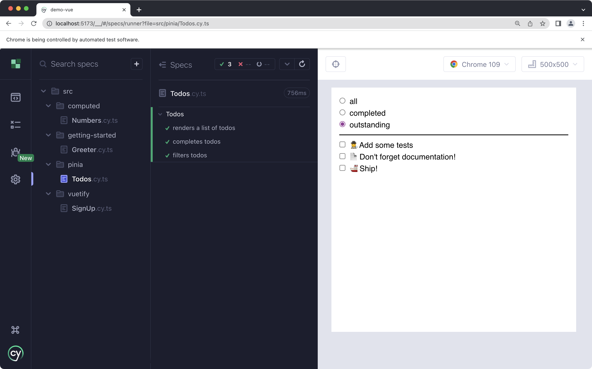

# Pinia

[Pinia](https://pinia.vuejs.org/) is a reactive store for Vue. It's similar to Redux, Vuex, etc. The techniques described here are also applicable to writing tests for components using those libraries.

The source code for this example can be found [here](https://github.com/lmiller1990/cypress-testing-handbook/tree/main/demo-vue/src/pinia).

## Getting Started

This guide assumes you have created a basic project similar to the one described in [Getting Started](/getting-started). Make sure you have Pinia installed:

```sh
npm install pinia
```

There are two ways to define with a Pinia store:

- [Options Store](https://pinia.vuejs.org/core-concepts/#option-stores)
- [Setup Store](https://pinia.vuejs.org/core-concepts/#setup-stores)

They work exactly the same. The only difference is how they are declared. Take a look at the links above to see the difference. This guide uses a [Setup Store](https://pinia.vuejs.org/core-concepts/#setup-stores). The primary reason is there is a known limitation for type safety when referencing `this` in getters ([noted here](https://pinia.vuejs.org/core-concepts/getters.html#getters)). I also like that Setup Stores are closer to the usual Composition API function you use in your components.

Regardless of the semantics, the component code and test code will look exactly the same.

## The Component

I used Cypress to develop this entire component from scratch. It's a simple `<Todos>` component. Here's how final version looks:



## Configuring Cypress and Pinia

In a standard Vue app, you install Pinia like this:

```ts
import { createApp } from "vue";
import { createPinia } from "pinia";
import App from "./App.vue";

const pinia = createPinia();
const app = createApp(App);

app.use(pinia);
app.mount("#app");
```

We need to do something similar in Cypress. We could do this on a spec-by-spec basis, but this creates a lot of boilerplate. Instead, we can do something similar to the [Vuetify guide](./vuetify). One key difference is we want a fresh Pinia store for each test. This will give us a clean slate, and ensure our tests are deterministic.

I like to do this in my `supportFile`, which is `cypress/support/component.ts` by default. All of `supportFile` is executed before each spec runs.

```ts
import { createPinia, Pinia, setActivePinia } from "pinia";

let pinia: Pinia;

// Run this code before each *test*.
beforeEach(() => {
  // New Pinia
  pinia = createPinia();

  // Set current Pinia instance
  setActivePinia(pinia);
});
```

Next, we need to make sure we install Pinia each time we mount a component, and pass the newly created instance. I like to do this with a custom `cy.mount()` function. In my usual applications, I normally just call this `cy.mount()`. To be explicit, I'll be naming it `cy.mountWithPinia` in this article.

```ts {14-35}
import { createPinia, Pinia, setActivePinia } from "pinia";

let pinia: Pinia;

// Run this code before each *test*.
beforeEach(() => {
  // New Pinia
  pinia = createPinia();

  // Set current Pinia instance
  setActivePinia(pinia);
});

function mountWithPinia(
  Comp: DefineComponent,
  options?: Parameters<typeof mount>[1]
): Cypress.Chainable {
  return mount(Comp, {
    ...options,
    global: {
      ...options?.global,
      plugins: [...(options?.global?.plugins ?? []), pinia],
    },
  });
}

declare global {
  namespace Cypress {
    interface Chainable {
      mountWithPinia: typeof mountWithPinia;
    }
  }
}

Cypress.Commands.add("mountWithPinia", mountWithPinia);
```

Now we are ready to start developing our `<Todos>` component!

## The Component

We will start with the fully completed store, and a component rendering each of the todos.

Let's start with the store. There's a good chunk of code, but it's mostly straight forward. Check the [Pinia docs](https://pinia.vuejs.org/) for more information. Bascally, we:

- declare some reactive state
- defines some computed values (`completedTodos`, `incompleteTodos`, `filteredTodos`)
- create a method to add a new todo

```ts
// store.ts
import { defineStore } from "pinia";
import { computed, reactive } from "vue";

interface Todo {
  id: number;
  text: string;
  completed: boolean;
}

export const filterTypes = ["all", "completed", "outstanding"] as const;

interface TodosState {
  todos: Todo[];
  filter: (typeof filterTypes)[number];
  nextId: 0;
}

export const useTodos = defineStore("todos", () => {
  const state = reactive<TodosState>({
    todos: [],
    filter: "all",
    nextId: 0,
  });

  const completedTodos = computed(() => {
    return state.todos.filter((todo) => todo.completed);
  });

  const incompleteTodos = computed(() => {
    return state.todos.filter((todo) => !todo.completed);
  });

  const filteredTodos = computed(() => {
    if (state.filter === "completed") {
      return completedTodos.value;
    } else if (state.filter === "outstanding") {
      return incompleteTodos.value;
    }
    return state.todos;
  });

  function addTodo(text: string) {
    state.todos.push({ text, id: state.nextId++, completed: false });
  }

  return {
    state,
    filteredTodos,
    completedTodos,
    incompleteTodos,
    addTodo,
  };
});
```

Finally, a component that uses the `todosStore`. It's self explanatory:

```vue
<script lang="ts" setup>
import { useTodos, filterTypes } from "./store";

const todosStore = useTodos();
</script>

<template>
  <div class="m-4">
    <ul>
      <li v-for="todo of todosStore.state.todos" :key="todo.id">
        <input
          data-cy="todo"
          type="checkbox"
          v-model="todo.completed"
          :id="`todo-${todo.id}`"
          class="mr-2"
        />
        <label :for="`todo-${todo.id}`">
          {{ todo.text }}
        </label>
      </li>
    </ul>
  </div>
</template>
```

## Testing the Component

Finally, time to write a test. The `<Todos>` component is basically a user interface for the `todos` store. While we will write some assertions validating the interface is correctly updated, we will also assert against the state of the store.

Before even mounting the component, I'll add some todos to the store. We can access the store by doing `useTodos()`, just like you would in a component.

Once the component is mounted, I'll assert:

- Current filter is `"all"`, which contains the correct number of todos
- The text for each todo is rendered in a `<label>`

```ts
import Todos from "./Todos.vue";
import { useTodos } from "./store";

describe("Todos", () => {
  it("renders a list of todos", () => {
    const todosStore = useTodos();

    todosStore.addTodo("👨‍💻 Write code");
    todosStore.addTodo("🕵️ Add some tests");
    todosStore.addTodo("📄 Don't forget documentation!");
    todosStore.addTodo("🚢 Ship!");

    cy.mountWithPinia(Todos);

    expect(todosStore.state.filter).to.eql("all");
    expect(todosStore.filteredTodos).to.have.length(4);

    for (const todo of todosStore.filteredTodos) {
      cy.get("label").contains(todo.text);
    }
  });
});
```

The test passes. Let's add another one - ensuring a todo is marked as completed when the checkbox (or associated label) is clicked.

To make the actual tests a little more concise and reduce boilerplate, I moved the setup (adding the todos) to a `beforeEach()`.

```ts {4-12,25-40}
import Todos from "./Todos.vue";
import { useTodos } from "./store";

describe("Todos", () => {
  beforeEach(() => {
    const todosStore = useTodos();

    todosStore.addTodo("👨‍💻 Write code");
    todosStore.addTodo("🕵️ Add some tests");
    todosStore.addTodo("📄 Don't forget documentation!");
    todosStore.addTodo("🚢 Ship!");
  });

  it("renders a list of todos", () => {
    cy.mountWithPinia(Todos);

    const todosStore = useTodos();
    expect(todosStore.state.filter).to.eql("all");
    expect(todosStore.filteredTodos).to.have.length(4);

    for (const todo of todosStore.filteredTodos) {
      cy.get("label").contains(todo.text);
    }
  });

  it("completes todos", () => {
    cy.mountWithPinia(Todos);

    const todosStore = useTodos();
    expect(todosStore.state.filter).to.eql("all");
    expect(todosStore.filteredTodos).to.have.length(4);

    cy.get("label")
      .contains("Write code")
      .click()
      .then(() => {
        expect(todosStore.completedTodos).to.have.length(1);
        expect(todosStore.completedTodos[0].text).to.contain("Write code");
      });
  });
});
```

Note the assertion:

```ts
cy.get("label")
  .contains("Write code")
  .click()
  .then(() => {
    expect(todosStore.completedTodos).to.have.length(1);
    expect(todosStore.completedTodos[0].text).to.contain("Write code");
  });
```

You need to do `then(() => ...)` before writing any assertions. This is to allow the next [microtask](https://javascript.info/microtask-queue) to execute, and for Pinia's state to update. This is exactly the same as doing `await wrapper.vm.$nextTick()` in Vue Test Utils.

## Adding Filters

To finish this example, we will let the user filter the todos.

```vue {8-18,21}
<script lang="ts" setup>
import { useTodos, filterTypes } from "./store";

const todosStore = useTodos();
</script>

<template>
  <div class="m-4">
    <ul>
      <li v-for="filter of filterTypes" :key="filter">
        <input
          type="radio"
          v-model="todosStore.state.filter"
          :value="filter"
          :id="filter"
          class="mr-2"
        />
        <label :for="filter">
          {{ filter }}
        </label>
      </li>
    </ul>

    <div class="w-full border border-b my-2" />

    <ul>
      <li v-for="todo of todosStore.filteredTodos" :key="todo.id">
        <input
          data-cy="todo"
          type="checkbox"
          v-model="todo.completed"
          :id="`todo-${todo.id}`"
          class="mr-2"
        />
        <label :for="`todo-${todo.id}`">
          {{ todo.text }}
        </label>
      </li>
    </ul>
  </div>
</template>
```

A quick test, too:

```ts
describe("Todos", () => {
  beforeEach(() => {
    const todosStore = useTodos();

    todosStore.addTodo("👨‍💻 Write code");
    todosStore.addTodo("🕵️ Add some tests");
    todosStore.addTodo("📄 Don't forget documentation!");
    todosStore.addTodo("🚢 Ship!");
  });

  it("filters todos", () => {
    cy.mountWithPinia(Todos);

    cy.get("label")
      .contains("Write code")
      .click()
      .get('[data-cy="todo"]')
      .should("have.length", 4);

    cy.get("label")
      .contains("completed")
      .click()
      .get('[data-cy="todo"]')
      .should("have.length", 1);

    cy.get("label")
      .contains("outstanding")
      .click()
      .get('[data-cy="todo"]')
      .should("have.length", 3);
  });
});
```



Works great! We could write some more targeted unit tests for the `todosStore`. I would consider this if the logic became signficantly more complex. Since this application is simple, I'm happy to test the store implicitly via the user interface, but it can be difficult to debug complex business logic in this fashion.

If I decided I needed more granular unit tests, I'd recommend a similar approach to the one described in [testing computed properties](./computed-properties). I would use [Jest](https://jestjs.io) or [Vitest](https://vitest.dev) for the unit tests, and Cypress for the component tests, to ensure everything is correctly wired up.

## Conclusion

- Write code in `supportFile`, by default `cypress/support/component.ts`, to execute befor each spec.
- Use a `beforeEach()` in `supportFile` to do pre-test setup.
- Use `setActivePinia` to correctly create a new Pinia store for each test.
- Write a custom `cy.mount()` function to reuse in all your tests.
- `global.plugins` is part of Vue Test Utils, which is used by Cypress for Vue. The full list of mounting options is documented [here](https://test-utils.vuejs.org/api/).
