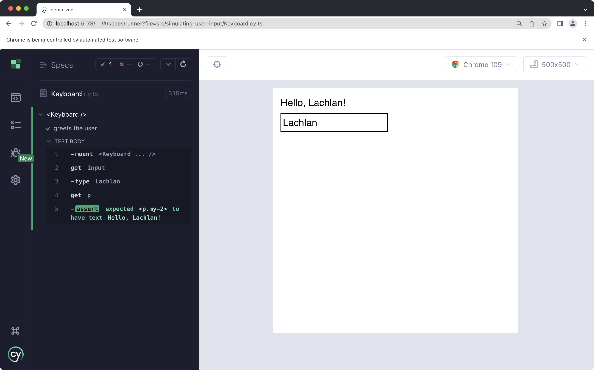
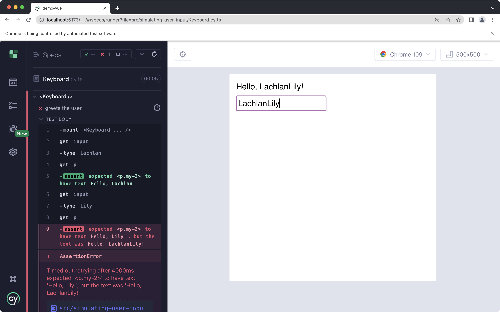

# Simulating User Input

Cypress can simulate all types of user input - this includes various keyboard inputs (including multiple keys simultaneously) and complex mouse movement. Cypress refers these as [action commands](https://docs.cypress.io/guides/core-concepts/interacting-with-elements#Actionability), and the general topic of simulating user input as [Actionability](https://docs.cypress.io/guides/core-concepts/interacting-with-elements#Actionability).

In this guide, we explore the various techniques for simulating user input, discuss some caveats, and finish up with some general recommendations.

## Typing

`cy.type()` is one the commands you will be using most frequently. It simulates typing - character by character. It's not a simple `input.value = '...'` under the hood - each character is fired, one by one, like a real user.

We will start with this simple `<Keyboard>` component to demonstrate some of the neat things `cy.type()` can do:

```vue
<script lang="ts" setup>
import { ref, computed } from "vue";

const username = ref("");
const greeting = computed(() => `Hello, ${username.value}!`);
</script>

<template>
  <div class="m-4 text-xl">
    <p class="my-2">{{ greeting }}</p>
    <input
      v-model="username"
      id="username"
      class="border p-1"
      name="username"
    />
  </div>
</template>
```

There is only really one thing to test at this point - fill in the `<input>`, and assert the correct greeting is shown.

```ts
import Keyboard from "./Keyboard.vue";

describe("<Keyboard />", () => {
  it("greets the user", () => {
    cy.mount(Keyboard);
    cy.get("input[name='username']").type("Lachlan");
    cy.get("p").should("have.text", "Hello, Lachlan!");
  });
});
```

It passes.



## Clearing Text

What if we change the name? You might attempt something like:

```ts {9,10}
import Keyboard from "./Keyboard.vue";

describe("<Keyboard />", () => {
  it("greets the user", () => {
    cy.mount(Keyboard);
    cy.get("input[name='username']").type("Lachlan");
    cy.get("p").should("have.text", "Hello, Lachlan!");

    cy.get("input[name='username']").type("Lily");
    cy.get("p").should("have.text", "Hello, Lily!");
  });
});
```

No good - it appends to the existing test.



You need to `cy.clear()` to clear the text:

```ts {9}
import Keyboard from "./Keyboard.vue";

describe("<Keyboard />", () => {
  it("greets the user", () => {
    cy.mount(Keyboard);
    cy.get("input[name='username']").clear().type("Lachlan");
    cy.get("p").should("have.text", "Hello, Lachlan!");

    cy.get("input[name='username']").clear().type("Lily");
    cy.get("p").should("have.text", "Hello, Lily!");
  });
});
```

## Special Character Sequences

Cypress also has support for various special character sequences. A list [can be found here](https://docs.cypress.io/api/commands/type#Arguments). To demonstrate, let's wrap the `<input>` in a `<form>` and submit it.

```vue
<script lang="ts" setup>
import { ref, computed } from "vue";

const username = ref("");
const greeting = computed(() => `Hello, ${username.value}!`);

function submit() {
  window.fetch("/sign_up", {
    method: "POST",
    body: JSON.stringify({
      username: username.value,
    }),
  });
}
</script>

<template>
  <div class="m-4 text-xl">
    <p class="my-2">{{ greeting }}</p>
    <form @submit.prevent="submit">
      <input
        v-model="username"
        id="username"
        class="border p-1"
        name="username"
      />
    </form>
  </div>
</template>
```

No submit button - no problem, you can submit a form by hitting enter, too, as long as one of the `<input>` elements in the form is focused.

Let's also use [`cy.intercept()`](https://docs.cypress.io/api/commands/intercept) to assert the form really was submitted, and with the correct payload.

```ts {12-26}
import Keyboard from "./Keyboard.vue";

describe("<Keyboard />", () => {
  it("greets the user", () => {
    cy.mount(Keyboard);
    cy.get("input[name='username']").type("Lachlan");
    cy.get("p").should("have.text", "Hello, Lachlan!");

    cy.get("input[name='username']").clear().type("Lily");
    cy.get("p").should("have.text", "Hello, Lily!");

    // Intercept *before* request is made.
    // Use .as('sign_up') so we can cy.wait() later.
    cy.intercept("/sign_up", (req) => {
      expect(req.body).to.eq(
        JSON.stringify({
          username: "Lily",
        })
      );
      req.reply("OK");
    }).as("sign_up");

    cy.get("input[name='username']").type("{enter}");

    // Ensure request is completed before test execution ends.
    cy.wait("@sign_up");
  });
});
```

We use `type("{enter}")` to submit the form.

## A `cy.intercept()` Pattern

This example shows a common pattern I like to use with `cy.intercept()`. Before the command that triggers the request, in this case submitting the form, I like to declare my `cy.intercept()` and use `.as()`, which is called an [alias](https://docs.cypress.io/api/commands/as). I can refer to the intercepted request later on using `.as('sign_up')`.

After the request should have been triggered, you can use `cy.wait()` to ensure the request will finish before the test ends. This also ensures the assert inside `cy.intercept()` will execute. I think this makes test more readable and reliable, especially when you start to write longer, more complex scenarios.

The pattern looks something like:

1. Declare intercept with `cy.intercept(...).as('req_name')`
2. Action that will trigger request
3. `cy.wait('@req_name')`

According to the Cypress docs, there's a more idiomatic way to write an assertion against an intercepted request. I'll show both for ease of comparison:

### Idiomatic Cypress

```ts
// 1. Intercept and alias
cy.intercept("/sign_up", "OK").as("sign_up");

// 2. Trigger request
cy.get("input[name='username']").type("{enter}");

// 3. Assertion (implicit `cy.wait()`)
cy.get("@sign_up")
  .its("request.body")
  .should("eql", JSON.stringify({
      username: "Lily",
  }})
```

### Alternative

```ts
// 1. Intercept and Assertion
cy.intercept("/sign_up", (req) => {
  expect(req.body).to.eq(
    JSON.stringify({
      username: "Lily",
    })
  );
  req.reply("OK");
}).as("sign_up");

// 2. Trigger request
cy.get("input[name='username']").type("{enter}");

// 3. Wait for request to complete
cy.wait("@sign_up");
```

Neither is better or worse to me - just trade offs. I like the idiomatic way, because it follows the traditional "Arrange, Act, Assert" pattern you often see in tests.

I also like the alterative - although Cypress generally recommends using `.should()` for explicit assertions, I somehow feel like

```ts
expect(req.body).to.eql(...)
```

... is more preferrable to ...

```ts
.its("request.body").should(...)
```

Both do the same thing - so it's a matter of personal preference.

## Conclusion

- `cy.get('input').type()` to type characters.
- `cy.get('input').clear()` to clear an input.
- Use `{}` for special sequences. A list [can be found here](https://docs.cypress.io/api/commands/type#Arguments).
- Combine `cy.intercept()` with `.as()` and `cy.wait()` to write assertions against requests.
