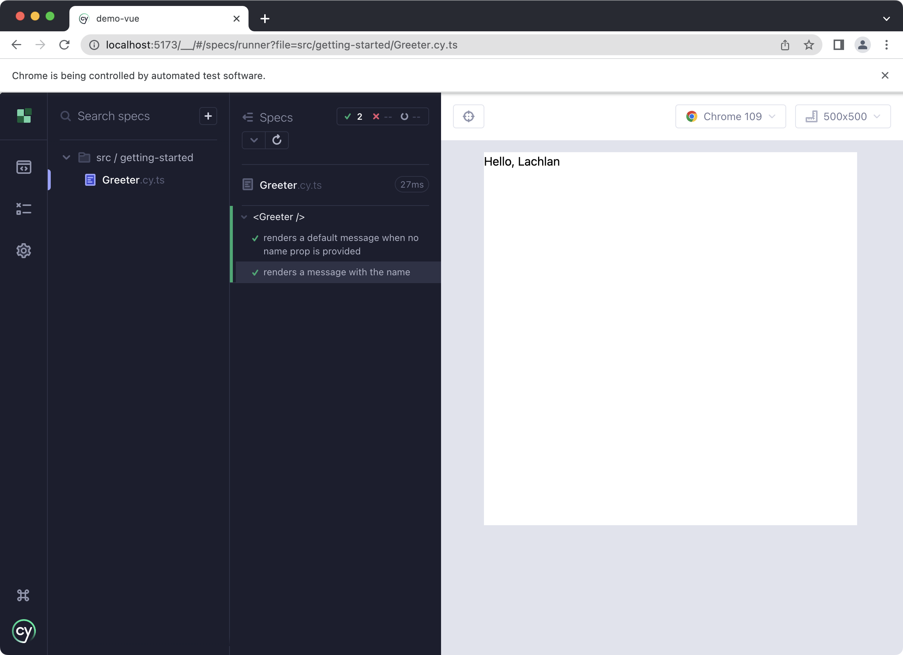

# Testing Props

One of the primary philosophies championed by React, Vue and other similar libraries is the concept f `props` - from a component's perspective, read only, one way data. A component's output is a function of its state, which usually means _local state_ and _props_.

This is the corner stone of the current generation of component libraries, and this is where we start; given X prop, a component should render Y.

## The Component

We start with the most basic possible component; a `<Greeter>` component.

```vue
<script lang="ts" setup>
const props = defineProps<{
  name?: string;
}>();
</script>

<template>
  <h1>Hello, {{ props.name ?? "World" }}</h1>
</template>
```

## What To Test?

This component is very simple. There's only really two scenarios to test:

1. `name` is optional, we want to add a test for the case that no value is provided.
2. Test that if `name` is provided, the correct message is rendered.

In addition, we could also write some tests around invalid props, such as `:name="{}" or `:name="Symbol('foo')"`. I don't see these as very valuable, though - TypeScript and a type checking step on CI during out build process will guard against this class of error.

## The Test

We mount the component with `cy.mount` - this is a custom command, and was set up automatically by Cypress in [Getting Started](/getting-started).

The first parameter is the component - this is the same for Vue, React, Angular, and any other framework Cypress supports.

```ts
import Greeter from "./Greeter.vue";

describe("<Greeter />", () => {
  it("renders a default message when no name prop is provided", () => {
    cy.mount(Greeter);
    cy.get("h1").contains("Hello, World");
  });
});
```

Simple enough - we find the `h1` and assert it contains the correct text with `contains`.

The other scenario is equally as simple to write a test for. To pass a prop, we use the second parameter to `mount`, which is an object of options. The underlying library is Vue Test Utils, and you can see the full list of options [here](https://test-utils.vuejs.org/api/).

```ts
import Greeter from "./Greeter.vue";

describe("<Greeter />", () => {
  it("renders a default message when no name prop is provided", () => {
    cy.mount(Greeter);
    cy.get("h1").contains("Hello, World");
  });

  it("renders a message with the name", () => {
    cy.mount(Greeter, {
      props: {
        name: "Lachlan",
      },
    });
    cy.get("h1").contains("Hello, Lachlan");
  });
});
```

In Cypress:



## Conclusion

- Mount a component with `cy.mount`.
- Assert some text was rendered with `cy.contains`.
- Pass `props` using the second parameter to `mount`.
- The full list of mounting options is from Vue Test Utils, documented [here](https://test-utils.vuejs.org/api/).
