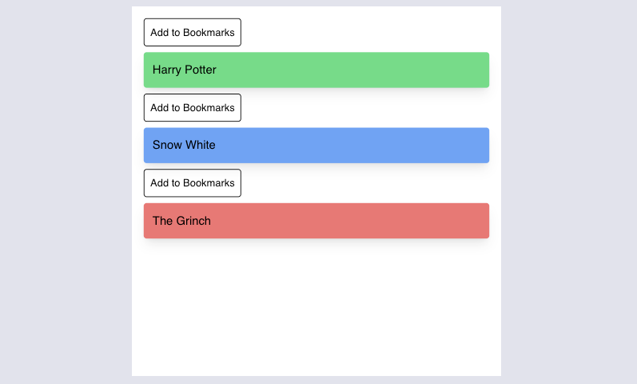
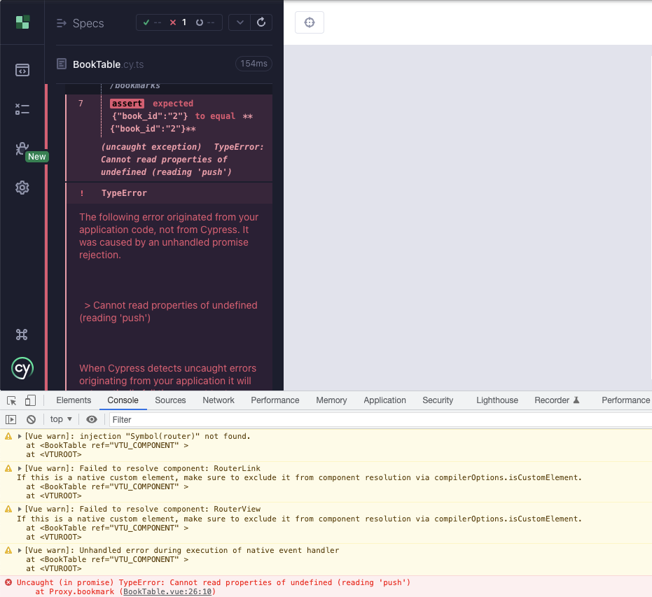
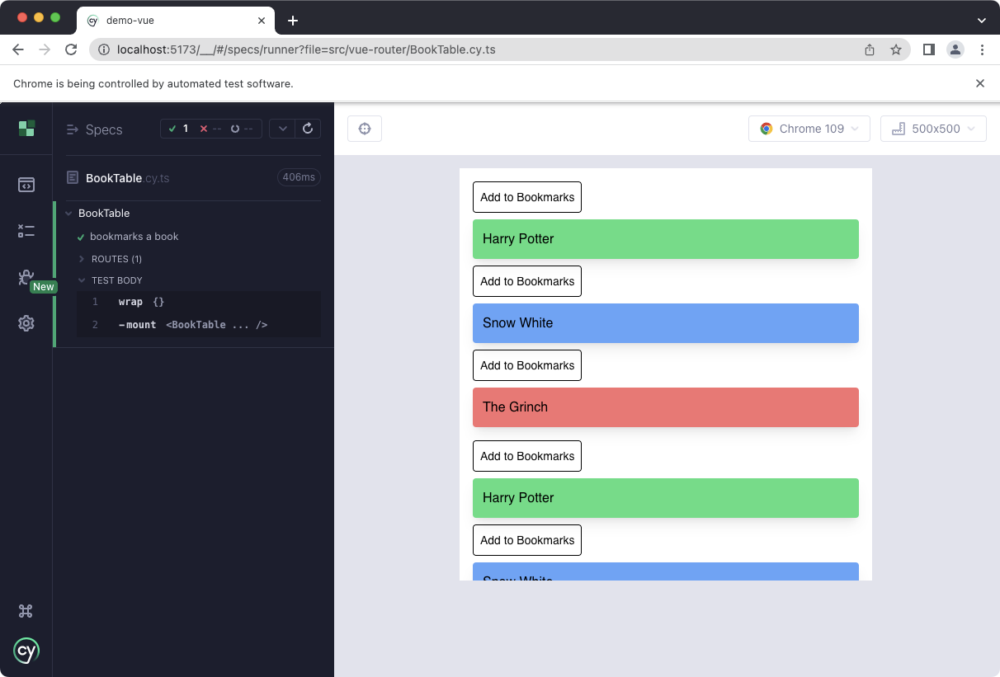
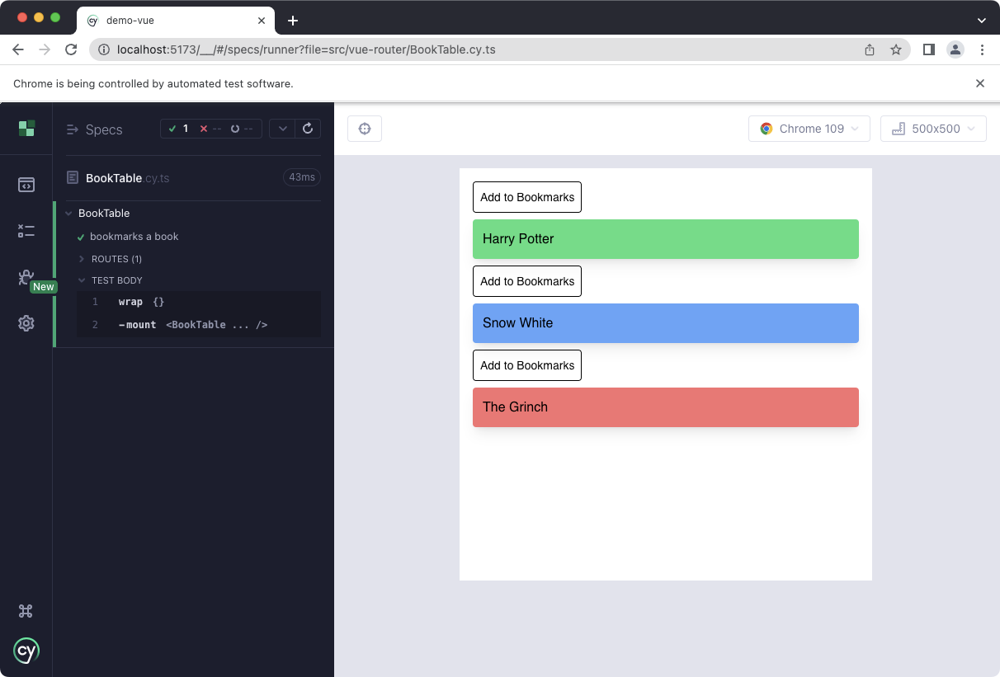

# Vue Router

[Vue Router](https://router.vuejs.org/) is the official router for Vue. This guide talks about how to test components that use or require Vue Router in Cypress Component Testing. It it quite a bit more philosophical and opinionated than the rest of this guide, based on my years of experience testing Vue apps.

The source code for this example can be found [here](https://github.com/lmiller1990/cypress-testing-handbook/tree/main/demo-vue/src/vue-router).

This guide is written for with Cypress Component Testing in mind. You should definitely be testing your router. That said, in the same way I don't generally write *unit* tests for my controllers when building a traditional MVC application with something like Ruby on Rails, I don't generally test routing in component tests. 

The routing is basically "the wiring" that glues your application together. I find a lot more value in testing routing in an End to End fashion. Vue Router generally relies on the entire component hierarchy existing, and when you write component tests, you are usually doing the opposite and *isolating* your components.

That said, there's always exceptions, so in this guide we will examine some techniques to test components that assume Vue Router exists and has been installed.

## The Component

The component has a bit of complexity, to demonstrate some of the pitfalls and caveats when it comes to routing in Component Tests.

```vue
<script lang="ts" setup>
import { useRouter } from "vue-router";

interface Book {
  id: string;
  name: string;
  color: string;
}

const books: Book[] = [
  { id: "1", name: "Harry Potter", color: "bg-green-400" },
  { id: "2", name: "Snow White", color: "bg-blue-400" },
  { id: "3", name: "The Grinch", color: "bg-red-400" },
];

const router = useRouter();

async function bookmark(book: Book) {
  await window.fetch("/bookmarks", {
    method: "POST",
    body: JSON.stringify({
      book_id: book.id,
    }),
  });

  router.push("/");
}
</script>

<template>
  <ul class="m-4">
    <li
      v-for="book of books"
      :key="book.id"
      :to="`/books/${book.id}`"
      :data-cy="book.name"
    >
      <button @click="bookmark(book)" class="border p-2 rounded text-sm">
        Add to Bookmarks
      </button>

      <RouterLink :to="`/books/${book.id}`">
        <div
          class="shadow-lg p-3 my-2 rounded flex items-center justify-between"
          :class="book.color"
        >
          <div>{{ book.name }}</div>
        </div>
      </RouterLink>
    </li>
  </ul>

  <RouterView />
</template>
```

It renders a list of books. When you click one, it goes to `/books/:id`. Clicking Bookmark makes a POST request, and redirects to the home page with `router.push("/")`.

We also need a router:

```ts
import { createRouter, createWebHistory } from "vue-router";
import BookTable from "./BookTable.vue";
import App from "../App.vue";
import { defineComponent, h } from "vue";

const router = createRouter({
  history,
  routes: [
    {
      path: "/",
      component: App,
    },
    {
      path: "/books",
      component: BookTable,
      children: [
        {
          path: ":id",
          component: defineComponent({
            setup() {
              // placeholder
              return () => h("div", "OK");
            },
          }),
        },
      ],
    },
  ],
});

// ... 

app.use(router)
```

The application looks like this when we visit `/books`:



This application has a root level `<App>` component at `/`, which renders a `<RouterView>`. When we visit  `/books`, `<BookTable>` in rendered in place of the `<RouterView>`.

`<BookTable>` *also* has a `<RouterView>`. It renders when we visit `/books/:id`.

There's some important here. `<BookTable>` *expects to be rendered when the current route is `/books`*. This will cause problems in our test - the root component, `/`, won't rendered, since we are going to mount `<BookTable>` in isolation.

Let's try a test with `cy.mount()`:

```ts
describe("BookTable", () => {
  it("bookmarks a book", () => {
    // Ensure request is intercepted with correct payload.
    cy.intercept("/bookmarks", (req) => {
      expect(req.body).to.eq(
        JSON.stringify({
          book_id: "2",
        })
      );
      req.reply("OK");
    }).as("bookmarks");

    cy.mount(BookTable);
  });
});
```

Errors and warnings!



The problem is we haven't got a router installed when we mount the `<BookTable>`. I added one in `main.ts` for the actual application (using `createRouter()` and `app.use(router)`). We need something similar in `cy.mount()`. 

I usually just add this to my `cy.mount()` function, be to make it more clear in this guide, I am going to define a new `mountWithRouter()` function. First, let's talk about history modes.

## History Modes

[Vue Router](https://router.vuejs.org/guide/essentials/history-mode.html) has a few different history modes. Normally you use [`createWebHistory()`](https://router.vuejs.org/guide/essentials/history-mode.html#html5-mode), the standard HTML5 history router.

This is not really ideal in a test environment, though. Cypress serves the specs via a dev server - we don't actually want to navigate away, or unexpected things happen. What we want is [Memory History](https://router.vuejs.org/guide/essentials/history-mode.html#memory-mode), which is designed for this exact purpose. It still works like a standard Vue router, just without interacting with the URL.

I want to use the same routes in my test as my main application (or do we? Let's see...). I refactored my router file to facilitate passing in a different history type:

```ts
import { createRouter, createWebHistory } from "vue-router";
import BookTable from "./BookTable.vue";
import App from "../App.vue";
import { defineComponent, h } from "vue";

export const buildRouter = (history = createWebHistory()) => {
  return createRouter({
    history,
    routes: [
      {
        path: "/",
        component: App,
      },
      {
        path: "/books",
        component: BookTable,
        children: [
          {
            path: ":id",
            component: defineComponent({
              setup() {
                // placeholder
                return () => h("div", "OK");
              },
            }),
          },
        ],
      },
    ],
  });
};
```

Now, my new `mountWithRouter()` command in `cypress/support/component.ts`:

```ts
import { mount } from "cypress/vue";
import { createMemoryHistory } from "vue-router";
import { buildRouter } from "../../src/vue-router/router";

function mountWithRouter(
  Comp: DefineComponent,
  options: Parameters<typeof mount>[1] = {}
) {
  const router = buildRouter(createMemoryHistory());
  // Need to navigate manually for memory history
  router.push("/books");

  // Wait for router to be "ready" - memory history caveat
  cy.wrap(router.isReady()).then(() => {
    return mount(Comp, {
      ...options,
      global: {
        ...options?.global,
        plugins: [...(options?.global?.plugins ?? []), router],
      },
    });
  });
}

declare global {
  namespace Cypress {
    interface Chainable {
      mountWithRouter: typeof mountWithRouter;
    }
  }
}

Cypress.Commands.add("mountWithRouter", mountWithRouter);
```

Let's try it out:

```ts {13}
describe("BookTable", () => {
  it("bookmarks a book", () => {
    // Ensure request is intercepted with correct payload.
    cy.intercept("/bookmarks", (req) => {
      expect(req.body).to.eq(
        JSON.stringify({
          book_id: "2",
        })
      );
      req.reply("OK");
    }).as("bookmarks");

    cy.mountWithRouter(BookTable);
  });
});
```

The warnings and errors are gone... but something isn't quite right. The component is duplicated!



The problem is the assumption from earlier. Here it is, as a reminder:

**`<BookTable>` expects to be rendered when the current route is `/books`**.

Right now, we are mounting `<BookTable>` as the main component. It is designed to be rendered when the route is `/books`. It contains a `<RouterView>` which is *supposed* to match `/books/:id` (which is does, in the full applcation with the correct component hierarchy). What's happening in our test, however, is:

1. We mount `<BookTable>`
2. It renders `<RouterView>`
3. We do `router.push("/books")` in `mountWithRouter()`
4. Since a route matches `/books`, `<RouterView>` renders the component... which is another `<BookTable>`, according to how we configured the router.

Confusing - the problem the router is written with a specific component hierarchy in mind, which doesn't match here, since we want to render our component in isolation. These two things are in conflict. I still want to iterate on my `<BookTable>` in isolation, though. What are the options?

## Stubbing RouterView

We can simply stub out the `<RouterView>`. We can do that with `global.stubs`, which comes from Vue Test Utils. Those, and the other options, are documented [here](https://test-utils.vuejs.org/api/). `RouterView: true` will give us a default stub.

```ts {15-19}
import BookTable from "./BookTable.vue";

describe("BookTable", () => {
  it("bookmarks a book", () => {
    cy.intercept("/bookmarks", (req) => {
      expect(req.body).to.eq(
        JSON.stringify({
          book_id: "2",
        })
      );
      req.reply("OK");
    }).as("bookmarks");

    cy.mountWithRouter(BookTable, {
      global: {
        stubs: {
          RouterView: true
        }
      }
    });
  });
});
```

It works!



Let's finish off the test, by bookmarking a book.

```ts
import BookTable from "./BookTable.vue";

describe("BookTable", () => {
  it("bookmarks a book", () => {
    cy.intercept("/bookmarks", (req) => {
      expect(req.body).to.eq(
        JSON.stringify({
          book_id: "2",
        })
      );
      req.reply("OK");
    }).as("bookmarks");

    cy.mountWithRouter(BookTable, {
      global: {
        stubs: {
          RouterView: true
        }
      }
    });

    cy.get("[data-cy='Snow White']").within(() => {
      cy.get("button").contains("Bookmark").click();
    });

    cy.wait("@bookmarks");
  });
});
```

Let's quickly exmaine the function called when we click "Bookmark":

```ts
async function bookmark(book: Book) {
  await window.fetch("/bookmarks", {
    method: "POST",
    body: JSON.stringify({
      book_id: book.id,
    }),
  });

  router.push("/");
}
```

We have test coverage on the `window.fetch()` method - we wrote the assertion inside of `cy.intercept()`. You might be tempted to assert the router was correct changed, too, but this is suprisingly hard.

If you really want to, you can access it with an alias, like below. I wouldn't recommend this, and I'll explain why after:

```ts {20,27-30}
import BookTable from "./BookTable.vue";

describe("BookTable", () => {
  it("bookmarks a book", () => {
    cy.intercept("/bookmarks", (req) => {
      expect(req.body).to.eq(
        JSON.stringify({
          book_id: "2",
        })
      );
      req.reply("OK");
    }).as("bookmarks");

    cy.mountWithRouter(BookTable, {
      global: {
        stubs: {
          RouterView: true,
        },
      },
    }).as("wrapper");

    cy.get("[data-cy='Snow White']").within(() => {
      cy.get("button").contains("Bookmark").click();
    });
    cy.wait("@bookmarks");

    // Possible, but not documented. Not recommended!
    cy.get("@wrapper").then(({ wrapper }) =>
      expect(wrapper.vm.$router.currentRoute.value.fullPath).to.eql("/")
    );
  });
});
```

The fact this is so convoluted (and undocumented) is a code smell. This is testing *implementation details* (how something works) instead of the *behavior* (what is does). What we really want to assert is that we navigated *to the correct page*. For example, I should be able to see whatever appears on the root of my application.

This is why I think routing is better tested using an End to End test. You can still use a component test to design and iterate on a component that requires a route, and I do this all the time - but I don't use component tests to verify the actual router behavior. I think this is an End to End concern.

*Coming soon: how to write an End to End test for this*.

## Conclusion

- Create a router with [Memory History](https://router.vuejs.org/guide/essentials/history-mode.html#memory-mode) for testing.
- Create a custom `mount` function with a router is `cypress/support/component.ts` to reuse in all your tests.
- Navigate manually and use `router.isReady()` befor mounting the component.
- Stub out `<RouterView>` for more reliable, isolated tests.
- `global.stubs` is part of Vue Test Utils, which is used by Cypress for Vue. The full list of mounting options is documented [here](https://test-utils.vuejs.org/api/).
