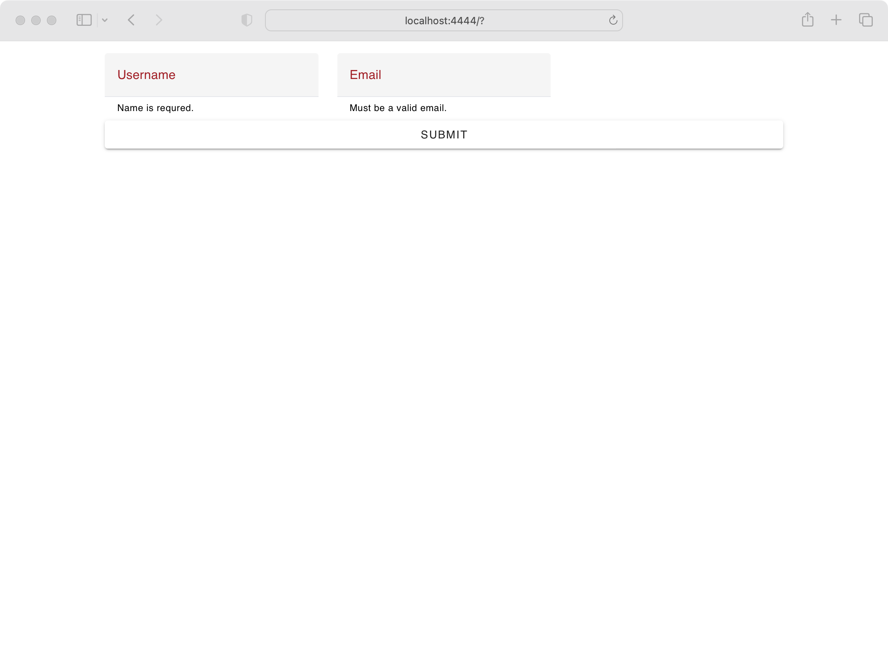
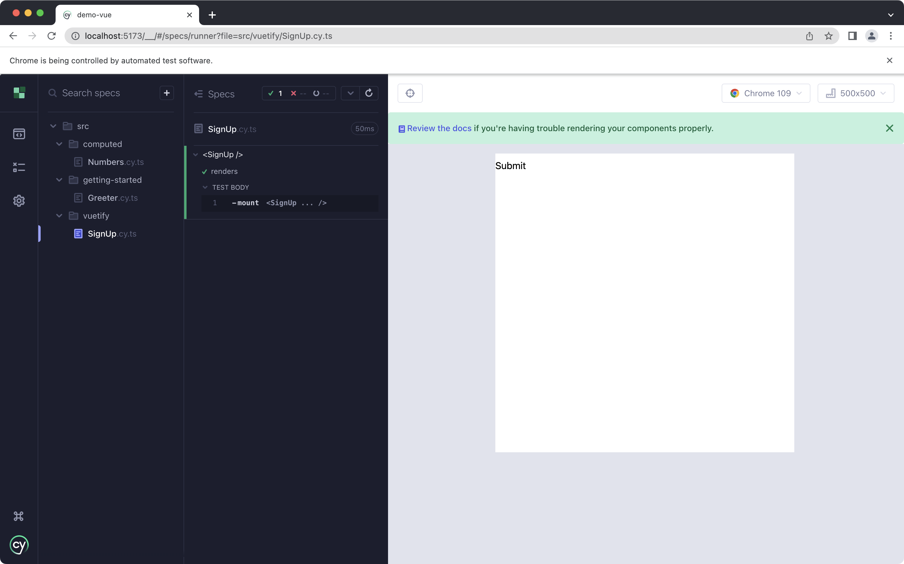
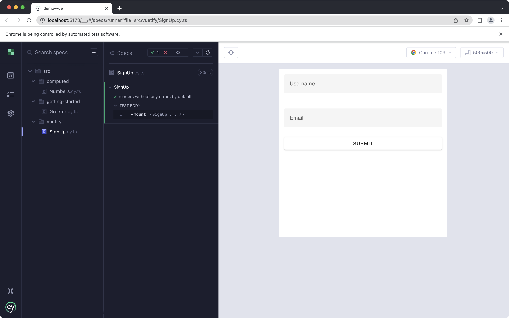
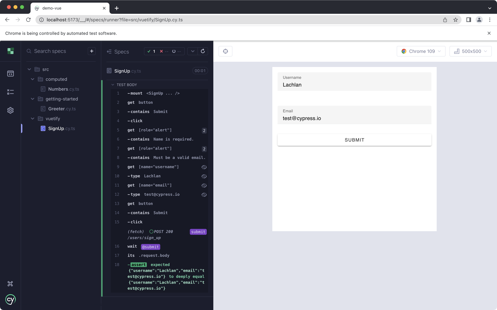

# Vuetify

[Vuetify](https://next.vuetifyjs.com/en/getting-started/installation/) is one of the most popular component libraries for Vue. Applications built using Vuetify can be easily tested using Cypress. This guide will set up Vuetify in Cypress, then illustrate how to create and test a form using built using Vuetify.

The source code for this example can be found [here](https://github.com/lmiller1990/cypress-testing-handbook/tree/main/demo-vue/src/vuetify).

## Getting Started

This guide assumes you have created a basic project similar to the one described in [Getting Started](/getting-started). Make sure you have Vuetify installed:

```sh
npm install vuetify@3
```

This guide installs Vuetify [manually](https://next.vuetifyjs.com/en/getting-started/installation/#manual-steps), but it should work the same if you are using one of their plugins, such as [`vite-plugin-vuetify`](https://www.npmjs.com/package/vite-plugin-vuetify).

Vuetify recommends configuring the library in `main.ts`:

```ts
import "vuetify/styles";
import { createVuetify } from "vuetify";
import * as components from "vuetify/components";
import * as directives from "vuetify/directives";

const vuetify = createVuetify({
  components,
  directives,
});

const app = createApp(App);
app.use(vuetify);
```

We will need to do something similar in our Cypress `supportFile`, which is in `cypress/support/component.ts` by default. This is because `main.ts` is not executed in our component tests. In general, any global setup you do in `main.ts` will also need required in `supportFile`. This doesn't mean you need to duplicate code - you could make a function that both modules import. This example will just copy and paste the setup, to keep things as simple as possible.

## The Component

In this example, we will test a user sign up form created using Vuetify components. Vuetify forms are documented [here](https://next.vuetifyjs.com/en/components/forms/#forms).

```vue
<script lang="ts" setup>
import { ref } from "vue";

const valid = ref(false);

const username = ref("");
const usernameRules = [
  (value: string) => {
    if (value) {
      return true;
    }
    return "Name is required.";
  },
  (value: string) => {
    if (value.length <= 10) {
      return true;
    }
    return "Name must be less than 10 characters.";
  },
];

const email = ref("");
const emailRules = [
  (value: string) => {
    if (value.includes("@")) {
      return true;
    }
    return "Must be a valid email.";
  },
];

function submit() {
  if (!valid.value) {
    return;
  }

  window.fetch("/users/sign_up", {
    body: JSON.stringify({
      username: username.value,
      email: email.value,
    }),
  });
}
</script>

<template>
  <v-form v-model="valid" @submit.prevent="submit">
    <v-container>
      <v-row>
        <v-col cols="12" md="4">
          <v-text-field
            name="username"
            v-model="username"
            :rules="usernameRules"
            :counter="10"
            label="Username"
            required
          />
        </v-col>

        <v-col cols="12" md="4">
          <v-text-field
            name="email"
            v-model="email"
            :rules="emailRules"
            label="Email"
            required
          />
        </v-col>
      </v-row>
      <v-btn type="submit" block class="mt-2">Submit</v-btn>
    </v-container>
  </v-form>
</template>
```

It looks like this in the browser:



## Configuring Cypress and Vuetify

Let's follow the previous examples, and mount our component using `cy.mount`:

```ts
import SignUp from "./SignUp.vue";

describe("SignUp", () => {
  it("renders without any errors by default", () => {
    cy.mount(SignUp);
  });
});
```

Underwhelming.



The reason it isn't rendering correctly is because we haven't configured Vuetify. This component is rendered in isolation. Right now, we are installing it globally in `main.ts`. We need to do something similar here:

```ts {3-11,16-18}
import SignUp from "./SignUp.vue";

import "vuetify/styles";
import { createVuetify } from "vuetify";
import * as components from "vuetify/components";
import * as directives from "vuetify/directives";

const vuetify = createVuetify({
  components,
  directives,
});

describe("SignUp", () => {
  it("renders without any errors by default", () => {
    cy.mount(SignUp, {
      global: {
        plugins: [vuetify],
      },
    });
  });
});
```

`global` and `plugins` are part of Vue Test Utils. Those, and the other options, are documented [here](https://test-utils.vuejs.org/api/).

Now the components are correctly displayed:



## Custom Mount Function

This works fine, but if you are using Vuetify, chances are you want it available in all your component tests, without having to install it on a a spec by spec basis. In this case, you can customize your `cy.mount` function. By default, that's in `cypress/support/component.ts`, and looks something like this:

```ts
import { mount } from "cypress/vue";

declare global {
  namespace Cypress {
    interface Chainable {
      mount: typeof mount;
    }
  }
}

Cypress.Commands.add("mount", mount);
```

Let's update it to include Vuetify.

```ts {3-25,31,36}
import { mount } from "cypress/vue";

import "vuetify/styles";
import { createVuetify } from "vuetify";
import * as components from "vuetify/components";
import * as directives from "vuetify/directives";
import type { DefineComponent } from "vue";

const vuetify = createVuetify({
  components,
  directives,
});

function mountWithVuetify(
  Comp: DefineComponent,
  options?: Parameters<typeof mount>[1]
): Cypress.Chainable {
  return mount(Comp, {
    ...options,
    global: {
      ...options?.global,
      plugins: [...(options?.global?.plugins ?? []), vuetify],
    },
  });
}

declare global {
  namespace Cypress {
    interface Chainable {
      mount: typeof mountWithVuetify;
    }
  }
}

Cypress.Commands.add("mount", mountWithVuetify);
```

I want to preserve the ability to pass other mounting options, such as `props`, so I spread the second argument, `...options`, to make sure those are passed through.

Now our test is much more concise:

```ts
import SignUp from "./SignUp.vue";

describe("SignUp", () => {
  it("renders without any errors by default", () => {
    cy.mount(SignUp);
  });
});
```

## Testing the Component

Now that we set up Vuetify, we can actually write some tests! I'm going attempt to test all scenarios in a single test:

1. Initial state - form is invalid, but no errors are shown.
2. Submit empty for - relevant errors are shown.
3. Fill out form.
4. Submit form - for is submitted with correct payload.

I have commented the example for completeness.

```ts
import SignUp from "./SignUp.vue";

describe("SignUp", () => {
  it("validates form and submits correct payload", () => {
    cy.mount(SignUp);

    // Submit - errors are shown
    cy.get("button").contains("Submit").click();

    // Assert errors are shown
    cy.get('[role="alert"]').contains("Name is required.");
    cy.get('[role="alert"]').contains("Must be a valid email.");

    // Fill in form
    cy.get('[name="username"]').type("Lachlan");
    cy.get('[name="email"]').type("test@cypress.io");

    // Intercept request - backend doesn't exist
    cy.intercept("/users/sign_up", "OK").as("submit");

    // Assert correct payload
    cy.get("button").contains("Submit").click();
    cy.wait("@submit")
      .its("request.body")
      .should(
        "eql",
        JSON.stringify({
          username: "Lachlan",
          email: "test@cypress.io",
        })
      );
  });
});
```

The test is pretty self explanatory - the most interesting part is probably `cy.intercept()`, which is [documented here](https://docs.cypress.io/api/commands/intercept). It's very powerful - you can intercept any type of request, inspect and modify both the request and the response. I've stubbed it out, since we don't have a backend. Instead, I just returned "OK". I don't often use a backend with my component tests. I generally opt to stub out any requests, but there might be some cases you want to use a real endpoint, which is fine, too - just make sure the backend is running prior to the test (perhaps using [`cy.task()`](https://docs.cypress.io/api/commands/task)).

The test passes!



## Conclusion

- Install Vuetify using `global.plugins`
- Create a custom `mount` function is `cypress/support/component.ts` to reuse in all your tests.
- Use `cy.intercept()` to stub out a request, making your tests more performance and deterministic.
- `global.plugins` is part of Vue Test Utils, which is used by Cypress for Vue. The full list of mounting options is documented [here](https://test-utils.vuejs.org/api/).
